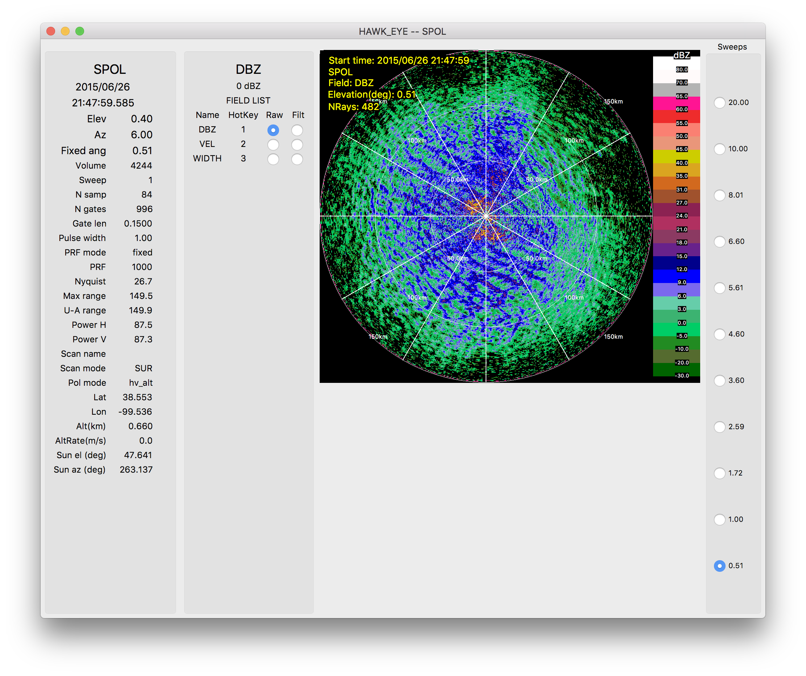
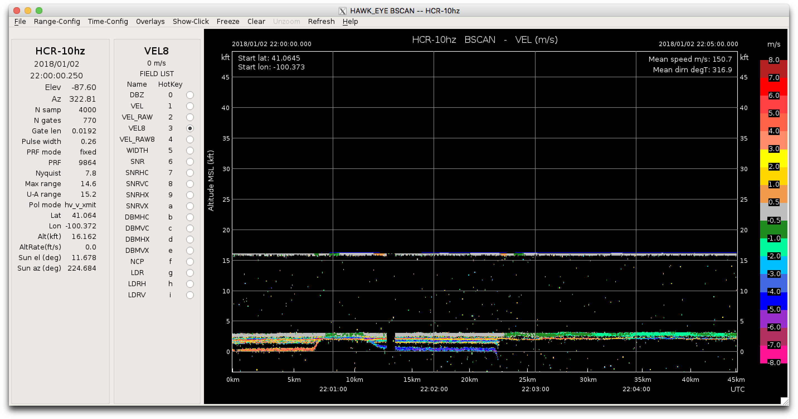

# HawkEye
What is HawkEye?

## Polar (PPI/RHI) Display

## BSCAN Display

## How to install HawkEye
### Linux
| From ... | Download Location | Install with ... | Start Command |
|----------|-------------------|------------------|---------------|
| Source   | | | |
| Container (Docker) | | | |
| RPM | | | |

### MacOS
| From ... | Download Location | Install with ... | Start Command |
|----------|-------------------|------------------|---------------|
| Source   | | | |
| Container (Docker) | | | |
| Brew | ** menus may not work ** | | |
|      | click away then back     | | |
| App | | | |

### Windows
| As ... |
|----------|
|[Linux subsystem](https://github.com/NCAR/lrose-core/issues/61) |

## How to use HawkEye
### The parameter file
#### How to generate one
#### Where is a default one?
#### The Top 10 Parameters

### The Color Scales

## The Future of HawkEye - advertisement

* Open Params File menu option
* Merge SOLOII into HawkEye
* UNDO 
* A few screen shots

### Demo with Data
~/Workshop2019
start_HawkEye.test  

data run from time 00:00 to 03:00:00
