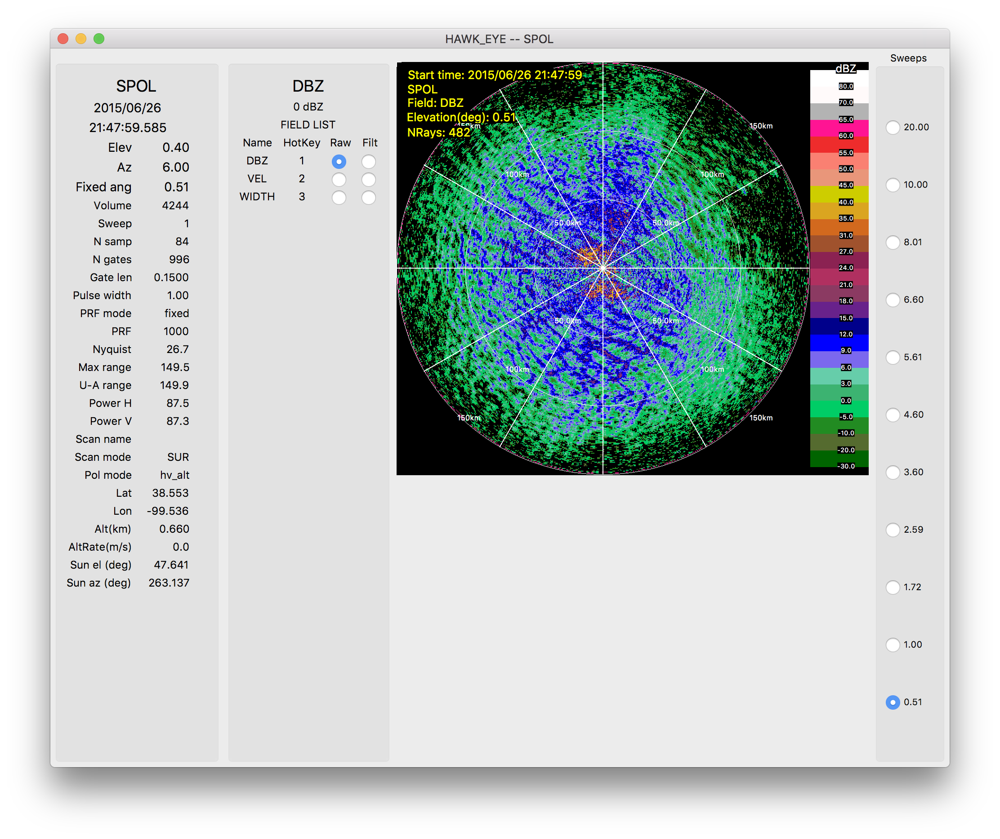
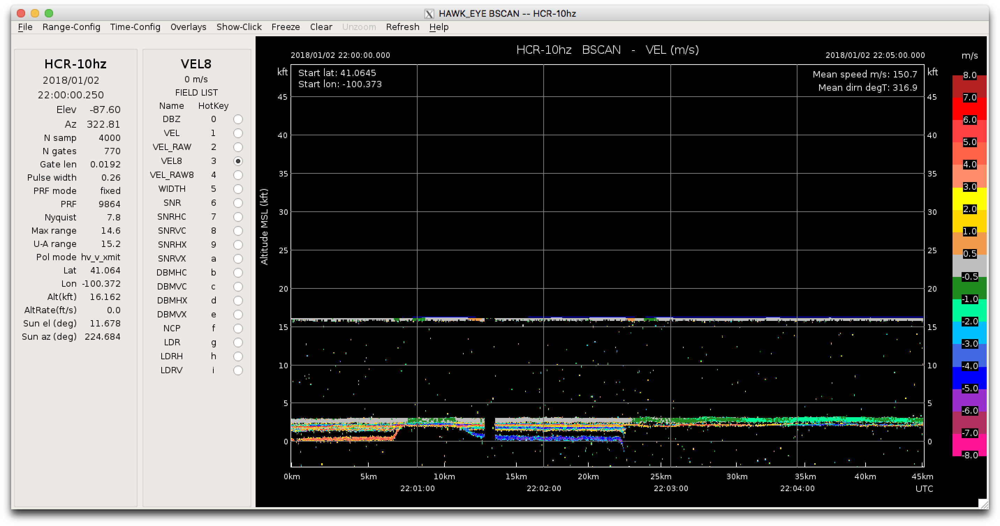

# HawkEye
What is HawkEye?

Quote from [NSF-LROSE](https://nsf-lrose.github.io/howtorun_HawkEye.html)
> HawkEye is a lidar and radar display tool. It can display real-time and archived CfRadial (and Dorade) data either in BSCAN,  PPI, or RHI geometry.

## Polar (PPI/RHI) Display



## BSCAN Display


## How to install HawkEye

### Linux
| From ... | Download Location | Install with ... | Start Command |
|----------|-------------------|------------------|---------------|
| Source   | [NSF LROSE](https://nsf-lrose.github.io/software.html)| | `/install/path/bin/HawkEye`|
| Container (Docker) | | 1st try lrose wrapper script (ask Bruno) `lrose -h`| 
|                    | | or run it straight away `docker run lrose-container`|
| RPM | [lrose-core](https://github.com/NCAR/lrose-core) | | |


### MacOS
| From ... | Download Location | Install with ... | Start Command |
|----------|-------------------|------------------|---------------|
| Source   | [NSF LROSE](https://nsf-lrose.github.io/software.html)| | |
| Container (Docker) | same as for Linux above | | |
| Brew |  | `brew install lrose-blaze` | `/usr/local/bin/HawkEye`|
|      |  |                            | ** menus may not work ** |
|      |  |                            | click away then back |
| App | [lrose-core](https://github.com/NCAR/lrose-core)| download .dmg file; | click on App |
|     |                                                 | drag icon to Applications folder | |


### Windows
| As ... |
|----------|
|[Linux subsystem](https://github.com/NCAR/lrose-core/issues/61) |


## How to use HawkEye
Generally, just start HawkEye via the command line or click the App. 

```
HawkEye
HawkEye -h
HawkEye -f test_data/cfradial/kddc/20150626/cfrad.20150626_025610.151_to_20150626_030145.891_KDDC_v270_Surveillance_SUR.nc
HawkEye -p field_project.HawkEye.params
```

Then, you can play with the ...
1. parameter file
2. color scales
3. directory structure

### The parameter file

* Many parameters available to customize the display
* Many parameters can also be set on the command line

#### How to generate one
```
HawkEye --print_params 
HawkEye --print_params > field_project.HawkEye.params
```
#### Where is a default one?
#### The Top 10 Parameters

These are my favorites, the parameters I check and change to get things running.
1. archive vs. realtime mode
```
begin_in_archive_mode = TRUE; or FALSE;
```
2. parameter/field names
```
fields = {
        label = “DBZ”,
        raw_name = “DBZ”,
        filtered_name = “”,
        units = “dBZ”,
        color_map = “dbz.colors”,
        shortcut = “1”
};
```
3. start date and time
```
archive_start_time = “1970 01 01 00 00 00”;
```
4. some kind of end time 
```
archive_stop_time = “1970 01 01 00 00 00”;
archive_time_span_secs = 3600;
```
5. color scales
```
color_scale_dir = “../share/color_scales”;
```
6. data source ** Note: There is an expected directory structure for the data files
```
archive_data_url = “/data/cfradial/kddc”;
```
7. display mode (POLAR or BSCAN)
```
display_mode = POLAR_DISPLAY;
```
8. saving images to file
```
images_output_dir = “/tmp/images/HawkEye”;
```
9. image file format (png, jpg, gif)
```
images_file_name_extension = “png”;
```
10. debug mode
```
debug = DEBUG_NORM;
```

### The Color Scales
The color scales are expected to be in a particular location. However, there are some internal, default color scales:
*  default
*  rainbow
*  eldoraDbz
*  spolDbz
*  eldoraVel
*  spolVel
*  spolDiv

You can set the directory for color scales in 2 ways:
* Set to the absolute path
* Set as a path relative to the location of the application binary
executable.

### Expected directory structure and data file names
```
+-- field_project
|   +-- YYYYMMDD
|       +-- cfrad.YYYYMMDD_HHMMSS.SSS_to_YYYYMMDD_HHMMSS.SSS_*
```


## The Future of HawkEye - advertisement

* Open Params File menu option
* Merge SOLOII into HawkEye
* undo editing
* A few screen shots

### Demo with Data
~/Workshop2019
start_HawkEye.test  

data run from time 00:00 to 03:00:00
