# Example Images for Dual-Polarization Applications

## KDP, PID and Precipitation Rate Applications - example images

### DBZ

PPI 
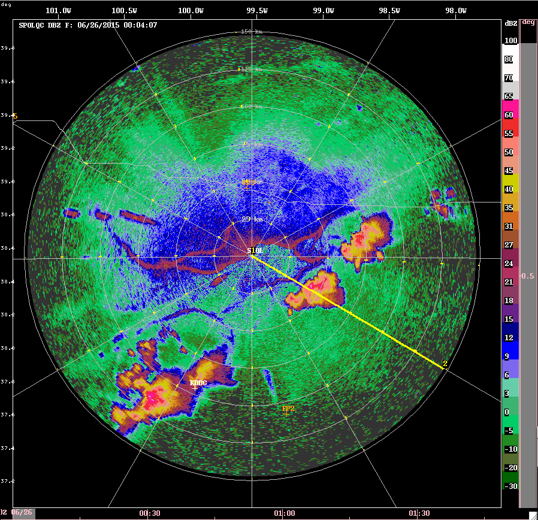

RHI 

### VEL

PPI 

RHI 
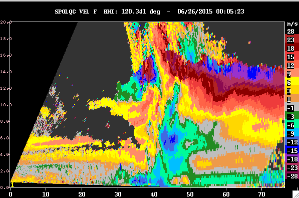

### WIDTH

PPI 

RHI 

### ZDR

PPI 
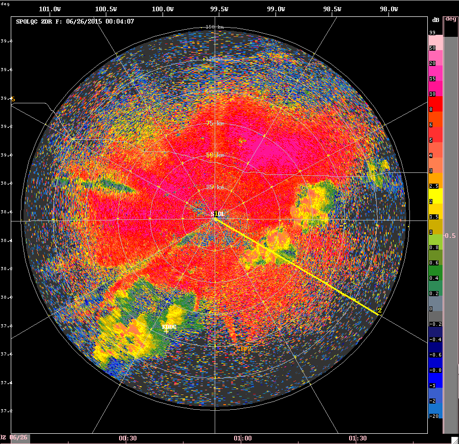

RHI 
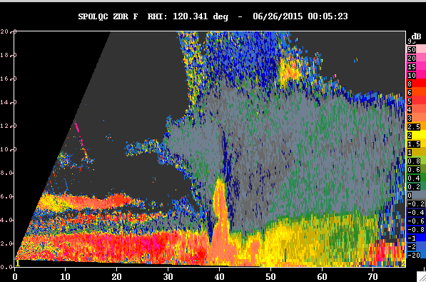

### PHIDP

PPI 

RHI 
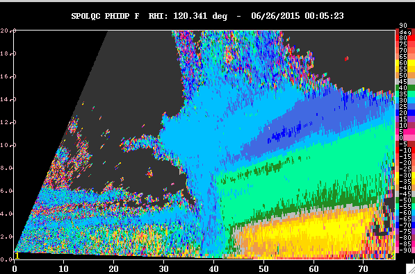

### RHOHV

PPI 
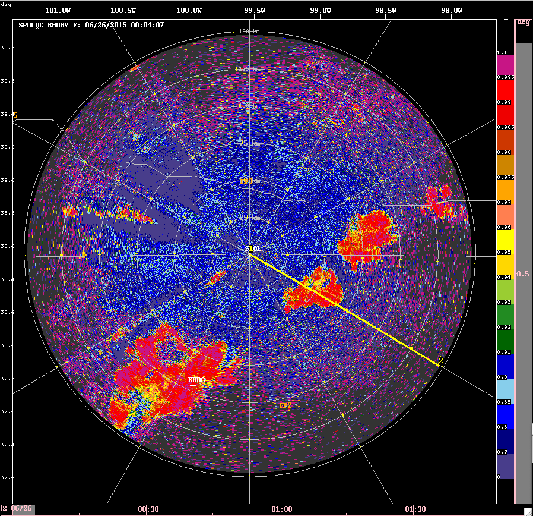

RHI 
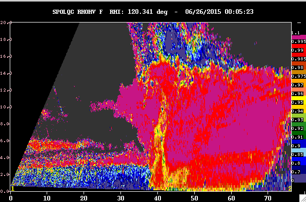

### TEMP

PPI 
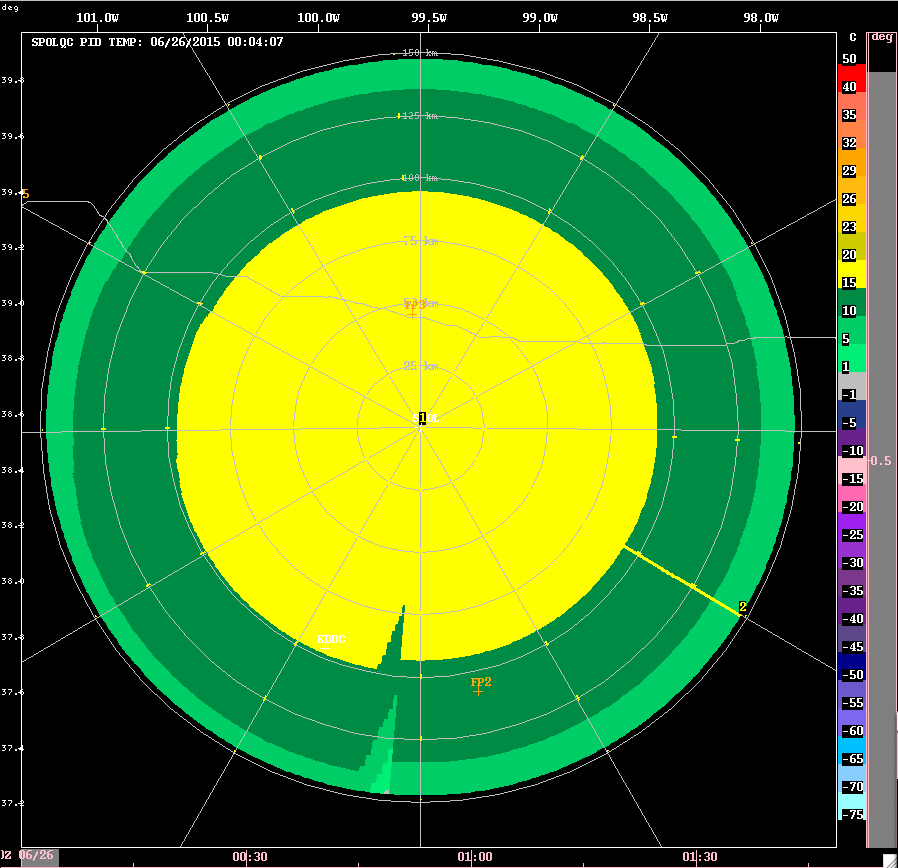

RHI 

### KDP

PPI 

RHI 
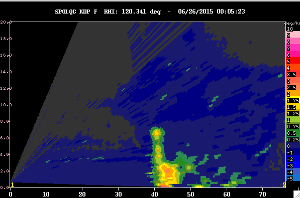

### PID

PPI 

RHI 

### RATE_ZH

PPI 

RHI 
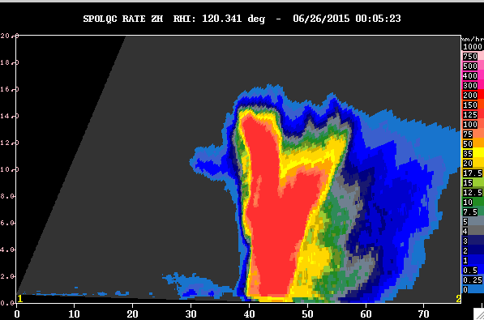

### RATE_KDP

PPI 
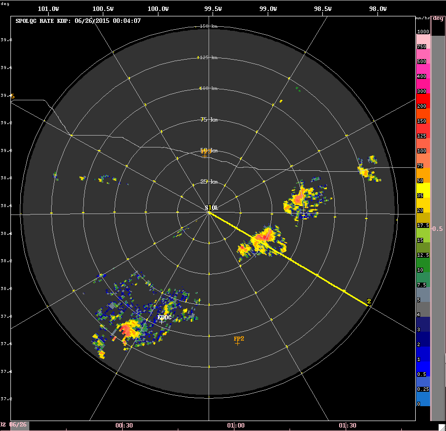

RHI 

### RATE_HYBRID

PPI 
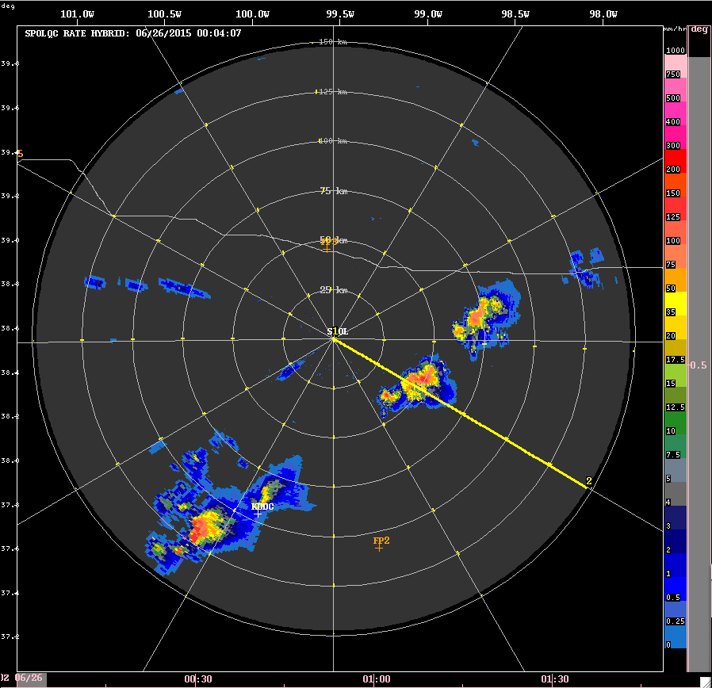

RHI 

### DBZ

PPI 

RHI 

