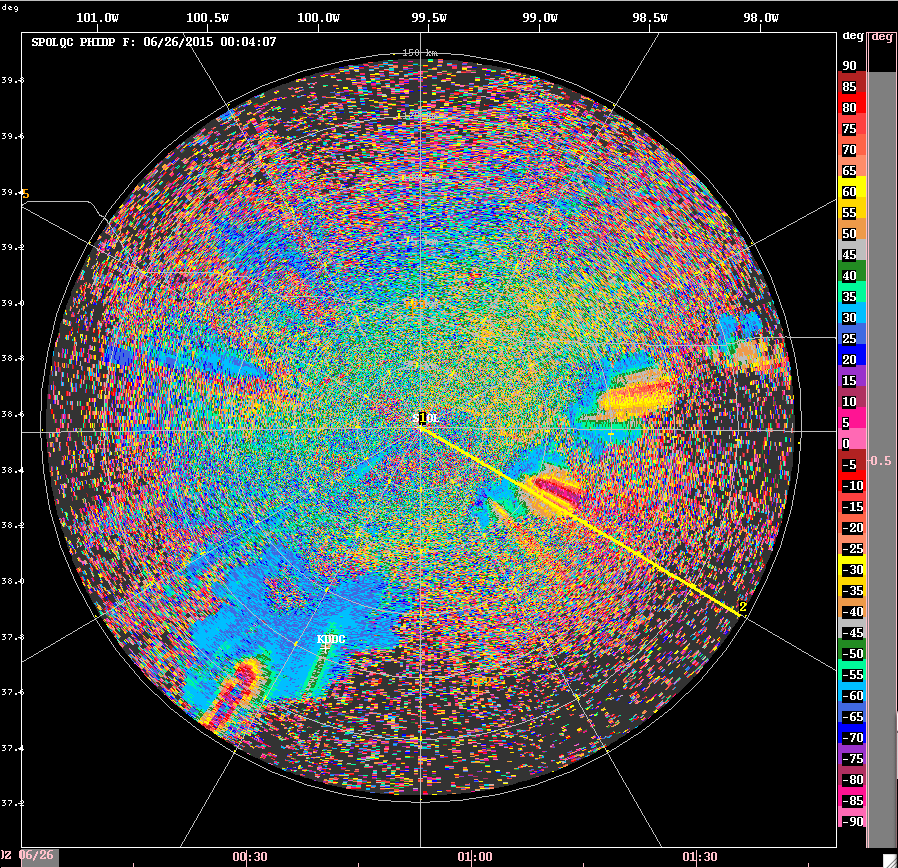

# Dual-Polarization Processing in LROSE

In this document we illustrate some of the basic operations
that the Radx apps in LROSE can perform for dual-polarization processing.

In these examples we are using some data from the NCAR S-Pol radar at the
site near Hays, Kansas during the PECAN field project in 2015.

## The measured fields

* DBZ
* ZDR
* RHOHV
* PHIDP
* TEMP
<!---
* VEL
* WIDTH
--->

### DBZ

PPI 

RHI 

<!---

### VEL

PPI 

RHI 

### WIDTH

PPI 

RHI 

--->

### ZDR

<!---
PPI 

--->

RHI 

### RHOHV

<!---
PPI 

--->

RHI 

### PHIDP

<!---
PPI 

--->

RHI 

### TEMPERATURE

<!---
PPI 

--->

RHI 

## The derived fields

* KDP
* PID (Particle ID, Hydrometeor type)
* PRECIP RATE

### KDP

We compute KDP from PHIDP.

It is defined as the slope of PHIDP in range, divied by 2.

KDP can be noisy - considerable smoothing and other filtering is required for good results.

<!---
PPI 

--->

RHI 

## We compute PDI from the above dual-pol fields, in addition to temperature

### PID

PID is computed using a fuzzy-logic approach.

<!---
PPI 

--->

RHI 

## Precip rate

Precip rate may be computed using DBZH, Z/ZDR and KDP.

### RATE_ZH

PPI 

<!---
RHI 

--->

### RATE_Z_ZDR

PPI 

<!---
RHI 

--->

### RATE_KDP

PPI 

<!---
RHI 

--->

### RATE_HYBRID

A hybrid rate may be estimated using a combination of the computed rates.

PPI 

<!---
RHI 

--->
