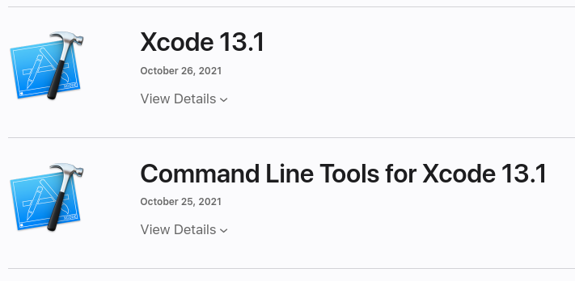

# LROSE-CORE package dependencies - OSX

### NOTE: this page requires ```admin``` privileges.

## Install XCode and the Command Line Tools

### Get an Apple ID (account)

To download the XCode package, get an Apple ID and register for the Apple App Store.

You will need to provide a credit card, so that Apple can charge you if you actually buy anything.  

However for our purposes here, XCode is free, so this will not actually cost you anything.

### Download XCode and Command line tools

Go to the developer download page:

* [http://developer.apple.com/downloads](http://developer.apple.com/downloads)

and you will find the following entries (perhaps with different versions):



Download both Xcode and the command line tools.

Xcode comes packaged as an ```.xip``` file.

The command line tools are packaged as a ```.dmg``` file.

### Install XCode and Command line tools (requries ```admin``` privileges)

Double-click on the downloaded items (in your browser) or open them in a terminal window. Follow the instructions for installation.

To complete the installation, you will need to have ```admin``` privileges.

### Run xcode-select

Then :

```
  xcode-select --install
```

### Reboot after XCode install

You should reboot after installing or upgrading XCode.

The reboot will perform some steps to complete the XCode install.

## Install homebrew (requries ```admin``` privileges)

To install brew you will need to run with admin privileges.

The official homebrew install docs are at:

* [https://docs.brew.sh/Installatio](https://docs.brew.sh/Installation)

To install brew, run the following script in a bash shell.

If you are not running bash, execute a bash shell first.

```
  /bin/bash
  /bin/bash -c "$(curl -fsSL https://raw.githubusercontent.com/Homebrew/install/HEAD/install.sh)"
  /usr/local/bin/brew update
```

The default location for homebrew is ```/usr/local```. So your account needs write permission
to ```/usr/local``` to perform the install.

More specifically, you need write permission for the following directories:

```
  /usr/local/Caskroom
  /usr/local/Cellar
  /usr/local/Frameworks
  /usr/local/Homebrew
  /usr/local/bin
  /usr/local/etc
  /usr/local/include
  /usr/local/lib
  /usr/local/opt
  /usr/local/sbin
  /usr/local/share
  /usr/local/var

```

WARNING - when using brew to install packages, do not use ```root``` or ```sudo```. This is very important. If you do, it will lead to permissions problems.

Only use admin privileges for installing brew itself, NOT for USING brew to install other packages.
